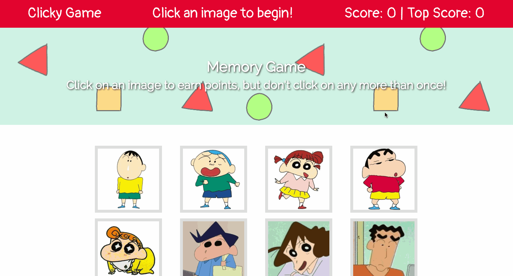

# memory-game
Memory game built with React. Click on an image to earn points, but don't click on any image more than once or you'll lose! (Inspired by the characters of the anime Crayon Shin Chan).
 
# Demo



# Technologies Used

- ReactJS
- HTML
- CSS

 ## Code Highlights
Function that handles the main logic for the game: keeps track of score, top score, cards that have been clicked and shuffling.

```javascript 
handleScore = clickedId => {
    var contained = false;
    for (var i = 0; i < this.state.clickedCardIds.length; i++) {
      if (this.state.clickedCardIds[i] === clickedId) {
        contained = true;
        break;
      }
    }

    if (contained) {
      this.setState({
        score: 0,
        clickedCardIds: [],
        cartoons: this.shuffle(this.state.cartoons)
      });
    } else {
      this.state.clickedCardIds.push(clickedId);
      const score = this.state.score + 1;
      const topScore = this.state.topScore + 1;
      if (score === topScore) {
        this.setState({
          score: score,
          topScore: topScore,
          cartoons: this.shuffle(this.state.cartoons)
        })
      } else {
        this.setState({
          score: score,
          cartoons: this.shuffle(this.state.cartoons)
        })
      }
    }
  };
  ```

# Links

[Deployed Game](https://leticiaroncero.github.io/memory-game)

[LinkedIn](https://www.linkedin.com/in/leticiaroncero/)
